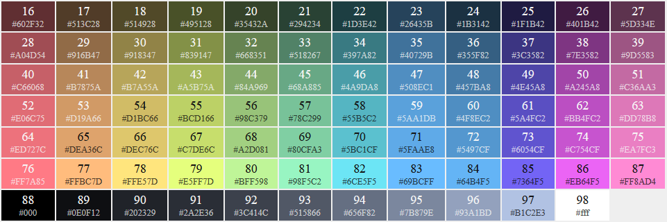
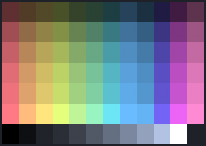

# lounge-onedark
One Dark color theme for [The Lounge](https://github.com/thelounge/lounge) IRC client.

Source code based on the [Zenburn theme](https://github.com/thelounge/lounge/blob/master/client/themes/zenburn.css) for The Lounge by [JP Smith](https://github.com/japesinator). 

Color scheme is based on the [One Dark color scheme](https://github.com/nathanbuchar/atom-one-dark-terminal) for iTerm, by [Nathan Buchar](https://github.com/nathanbuchar).

## Colors

### Colors 16-98

## Preview

## Install
`npm install thelounge-theme-onedark`